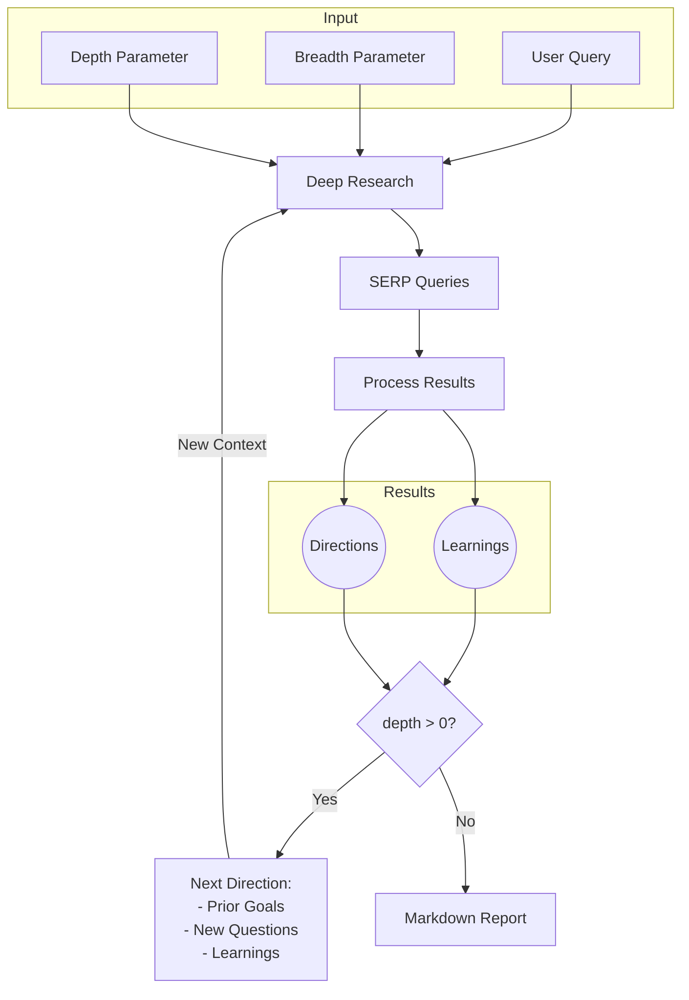

# System Patterns

## System Architecture

## Core Components

1. **Input Processing**
   - User query handling
   - Research parameter validation
   - Follow-up question generation

2. **Deep Research Engine**
   - Query generation
   - SERP processing
   - Result analysis
   - Context maintenance

3. **Recursive Processing**
   - Depth-based iteration
   - Context propagation
   - Direction refinement

4. **Output Generation**
   - Markdown report compilation
   - Source attribution
   - Information organization

## Key Technical Decisions

1. **API Integration**
   - Firecrawl API for web search and content extraction
   - OpenAI API for language model processing
   - Support for custom endpoints and models

2. **Deployment Options**
   - Local Node.js environment
   - Docker containerization
   - Environment-based configuration

3. **Concurrency Management**
   - Parallel search execution
   - Configurable concurrency limits
   - Rate limiting support

4. **Data Flow**
   - Iterative processing pipeline
   - Context preservation
   - Recursive exploration

## Design Patterns

1. **Configuration Management**
   - Environment variables
   - API key management
   - Endpoint customization

2. **Error Handling**
   - Rate limit management
   - API error recovery
   - Graceful degradation

3. **Extensibility**
   - Custom endpoint support
   - Model configuration
   - Concurrency adjustment

4. **Resource Management**
   - Concurrent request handling
   - Memory efficient processing
   - Stream-based operations
